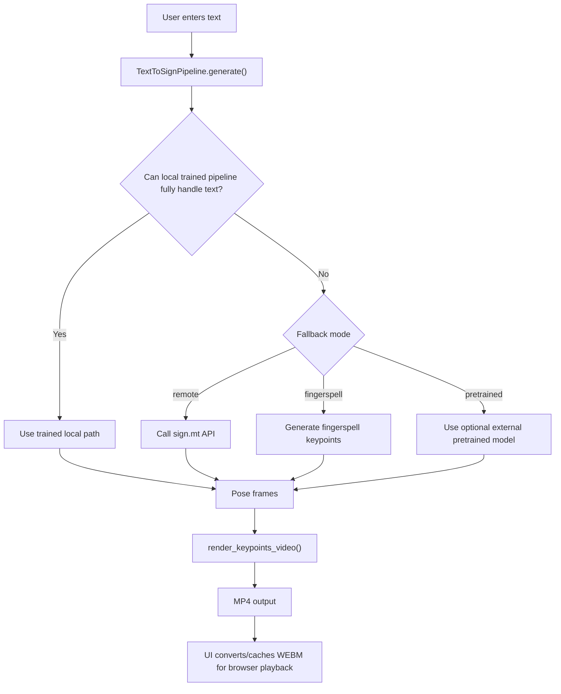

# Sign Language Translation Project – Complete Viva Guide

**Project type:** Text to Sign-Language Skeleton Video Generation  
**Prepared for viva date:** **May 9, 2026**  
**Repository path:** `D:\01_TY_BTECH_SEM_2\Sem_project\New_codex_proejct`

---

## 1) Project in One Line

This project converts **input English text** into a **sign-language style skeleton video** using trained local models, dataset-based retrieval, and fallback strategies for unknown text.

---

## 2) Problem Statement

Normal text users cannot directly communicate in sign video form.  
We need a system where:

- user enters text/sentence,
- system understands the text,
- system generates sign-language motion,
- system renders one playable output video in real time.

---

## 3) Main Objectives

1. Support trained dataset words with good quality output.
2. Avoid random broken skeleton lines.
3. Support unknown/random text using fallback strategies.
4. Provide real-time two-panel UI (left text, right video).
5. Keep the system practical for laptop-level hardware.

---

## 4) Technology Stack

## Programming & Runtime
- **Python 3.10**
- **HTML/CSS/JavaScript** (for local web UI)

## Core Libraries
- **PyTorch (`torch`)** for model training/inference
- **Transformers (`google/mt5-small`)** for text-to-gloss stage
- **OpenCV (`cv2`)** for video read/write and rendering
- **MediaPipe** for raw video keypoint extraction
- **NumPy, SciPy, tqdm**
- **huggingface_hub** for optional pretrained download

## Local HTTP UI
- Built using Python `http.server` in `signlang/web_app.py`

---

## 5) Pretrained / External Models and Services Used

### A) `google/mt5-small` (Hugging Face)
- Used in **Stage 1: Text → Gloss**.
- Fine-tuned on project text-gloss CSV pairs.
- Training script: `scripts/train_text2gloss.py`.

### B) Optional pretrained Text2Sign checkpoint
- Repo id used: `xiaruize/text2sign`
- Download command: `python main.py download-pretrained`
- Used only when `--fallback pretrained` is selected.

### C) MediaPipe Holistic
- Used in data preparation for extracting body + hand keypoints from raw signer video.

### D) Remote sign translation API (sign.mt)
- Used in `--fallback remote` mode for arbitrary unknown sentences.
- Converts text to pose stream, then locally rendered into skeleton video.

---

## 6) End-to-End Pipeline (How System Works)



---

## 7) Detailed Stages

## Stage 0: Dataset & Labeling

Input data is organized in gloss folders, for example:

- `data/skeleton_videos/train/Adjectives/80. tall/*.mp4`
- folder name is converted to gloss label (`TALL`)

Label creation utilities:
- `scripts/setup_data.py`
- `signlang/dataset.py`

What is generated:
- `data/labels/train_labels.csv`
- `data/text_gloss/train.csv`
- `data/text_gloss/valid.csv`

---

## Stage 1: Keypoint Extraction

Script: `scripts/extract_keypoints.py`

Two modes:
1. **`--mode raw`**  
   - reads real signer videos  
   - uses MediaPipe Holistic landmarks
2. **`--mode rendered`**  
   - reads already skeletonized videos  
   - detects red keypoint dots and tracks centroids

Output format:
- JSON clips in `data/keypoints/{train|valid|test}`
- each JSON has:
  - `gloss`
  - `source_video`
  - `extractor`
  - `frames` (normalized keypoints)

Keypoint shape:
- `JOINT_COUNT = 75`
- `FRAME_DIM = 150` (75 x 2)

---

## Stage 2: Text-to-Gloss Model

Script: `scripts/train_text2gloss.py`

Model:
- Fine-tunes **`google/mt5-small`**

Input:
- sentence from CSV

Output:
- gloss sequence (example: `"I am going home"` → `"HOME"`)

Metrics:
- BLEU
- Exact Match

Notes:
- Script includes PEFT compatibility guard for environments where bitsandbytes/peft versions conflict.

---

## Stage 3: Gloss-to-Pose Model

Script: `scripts/train_pose.py`

Custom model:
- `signlang/models/pose_transformer.py`
- encoder-decoder Transformer
- gloss tokens as source
- frame sequence as target

Training outputs:
- checkpoint: `outputs/checkpoints/pose_transformer.pt`
- logs: `outputs/logs/pose_train_*.csv`

Evaluation metrics:
- validation loss
- MPJPE (mean per-joint position error)
- keypoint accuracy (PCK-like threshold)

---

## Stage 4: Rendering to Video

Core renderer:
- `signlang/render.py`
- `render_keypoints_video()`

Behavior:
- draws skeleton connections on black background
- writes MP4 (`mp4v` codec)
- validates non-empty playable output (to avoid corrupt 44-byte files)

---

## Stage 5: Inference Pipeline + Fallback Logic

Core file:
- `signlang/pipeline.py`

Main class:
- `TextToSignPipeline`

Key behavior:
1. Try trained/local logic first for known glosses.
2. If unknown or incomplete (in remote mode), call remote sign translation.
3. If remote fails, fallback to local trained + fingerspell mode.
4. Return final mode details (`training_source_video_retrieval`, `remote_signmt_pose_render`, `fingerspell_fallback_remote_unavailable`, etc.)

This is why now system gives **playable output** instead of failing silently.

---

## Stage 6: Real-Time Web UI

Core file:
- `signlang/web_app.py`

Launch:
- `python main.py ui`

UI features:
- left panel text input
- right panel output video
- real-time translation with debounce
- status badges for mode/gloss/fallback
- browser-friendly `.webm` conversion cache
- cache validation to prevent serving broken videos

API endpoints:
- `GET /api/status`
- `POST /api/translate`
- `GET /videos/<filename>`

---

## 8) Current Project Snapshot (from `python main.py status` on May 8, 2026)

- train labels: `677`
- train keypoint clips: `677`
- valid keypoint clips: `467`
- text gloss train pairs: `330`
- text gloss valid pairs: `110`
- text checkpoint: `True`
- pose checkpoint: `True`
- generated videos: `92`

This proves models and pipeline artifacts are present.

---

## 9) Commands You Should Know for Viva Demo

## Install
```bash
pip install -r requirements.txt
```

## Data setup
```bash
python main.py setup-data --videos-dir data/skeleton_videos/train
```

## Keypoint extraction
```bash
python main.py prepare --mode rendered --split train --auto-label-from-folder --clean-output
python main.py prepare --mode rendered --split test
```

## Train models
```bash
python main.py train-text
python main.py train-pose
```

## Run from CLI
```bash
python main.py run --text "Tall wide clean beautiful" --fallback remote
python main.py run --text "The robot is dancing on Mars" --fallback remote
```

## Run UI
```bash
python main.py ui --fallback remote
```

## Check status
```bash
python main.py status
```

---

## 10) Fallback Modes (Very Important for Viva)

- **`strict`**: only trained/local known signs, no unknown completion.
- **`remote`**: local-first, then remote for unknown text; if remote fails, safe local fallback.
- **`fingerspell`**: unknown tokens become letter-by-letter sign approximation.
- **`pretrained`**: use optional downloaded pretrained text2sign model.

This design makes system robust for both:
- high-quality trained words, and
- arbitrary user text.

---

## 11) Important Files and Their Roles

- `main.py` → CLI command router (`run`, `prepare`, `setup-data`, `train-*`, `ui`)
- `signlang/pipeline.py` → central inference orchestration
- `signlang/web_app.py` → real-time web server and UI logic
- `signlang/render.py` → skeleton frame drawing and video writing
- `signlang/remote_signmt.py` → remote text-to-pose integration
- `signlang/fingerspell.py` → unknown token fallback generation
- `scripts/train_text2gloss.py` → MT5 fine-tuning
- `scripts/train_pose.py` → gloss-to-pose training
- `scripts/extract_keypoints.py` → keypoint extraction
- `scripts/setup_data.py` → label/text-gloss CSV auto-generation

---

## 12) Accuracy Discussion (How to Answer Honestly)

You can say:

1. Exact perfect sign grammar for all random sentences is still a research-level challenge.
2. For trained glosses, quality is strong because of dataset alignment + clip retrieval.
3. For unseen text, remote/fallback paths maintain coverage and avoid broken outputs.
4. Accuracy improves with:
   - more labeled gloss videos,
   - better sentence-to-gloss training pairs,
   - improved signer diversity and grammar mapping.

---

## 13) Strengths of This Project

- Hybrid design (local trained + remote + fingerspell fallback)
- Real-time UI with direct text-to-video experience
- Works with nested folder datasets
- Handles missing checkpoints gracefully
- Includes robustness fixes for corrupt/empty video outputs

---

## 14) Limitations

- True sign-language grammar for every domain sentence is not guaranteed yet.
- Rendered-skeleton extraction is weaker than raw MediaPipe extraction.
- Remote fallback needs internet and external service availability.
- Domain-specific vocabulary still depends on training data coverage.

---

## 15) Future Improvements

1. Larger curated text→gloss dataset with grammar rules.
2. Better gloss segmentation and language modeling.
3. Non-manual signals (face expressions/head pose emphasis).
4. Full signer-avatar rendering beyond skeleton points.
5. Quantitative human evaluation with deaf signer feedback.

---

## 16) Suggested Viva Demo Flow (5–7 Minutes)

1. Show architecture briefly (input text → gloss → pose → render).
2. Run `python main.py status` and explain checkpoints.
3. Run known sentence:  
   `python main.py run --text "Tall wide clean beautiful" --fallback remote`
4. Run unknown sentence:  
   `python main.py run --text "The robot is dancing on Mars" --fallback remote`
5. Start UI: `python main.py ui --fallback remote`
6. Type text in left panel and show right panel live output.
7. Explain fallback modes and practical robustness.

---

## 17) Quick Viva Q&A (Ready Answers)

**Q1. Which pretrained model did you use?**  
We used `google/mt5-small` for text-to-gloss fine-tuning. We also support optional external pretrained `xiaruize/text2sign` and remote sign.mt fallback.

**Q2. Why two-stage model?**  
Sign generation is easier and more controllable in two stages: first language mapping (text→gloss), then motion generation (gloss→pose frames).

**Q3. How do you handle unknown words?**  
In remote mode, unknown text goes to sign.mt. If that fails, system falls back to trained+fingerspell so output still remains playable.

**Q4. What is your output format?**  
Black background skeleton video (`.mp4`), and `.webm` copy for browser playback in UI.

**Q5. Why did you choose skeleton output?**  
Skeleton representation is lightweight, interpretable, and easier to train/debug than full photorealistic avatar generation.

---

## 18) Final Summary for Examiner

This is a **hybrid real-time text-to-sign skeleton system** with:

- dataset-driven training,
- transformer-based text and pose modeling,
- robust fallback for unknown sentences,
- and a practical UI for direct demonstration.

It is designed to be **usable, explainable, and extensible** for future full sign-language translation research.

